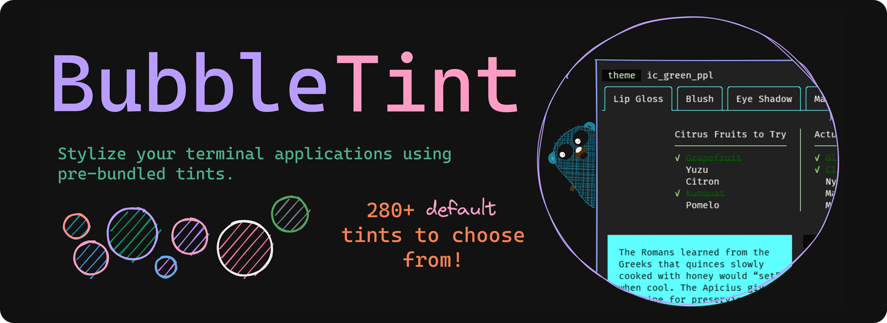

<!-- template:define:options
{
  "nodescription": true
}
-->


<!-- template:begin:header -->
<!-- do not edit anything in this "template" block, its auto-generated -->

<p align="center">
  <a href="https://github.com/lrstanley/bubbletint/tags">
    
  </a>
  <a href="https://github.com/lrstanley/bubbletint/commits/master">
    
  </a>


  <a href="https://github.com/lrstanley/bubbletint/actions?query=workflow%3Atest+event%3Apush">
    
  </a>

  <a href="https://codecov.io/gh/lrstanley/bubbletint">
    
  </a>

  <a href="https://pkg.go.dev/github.com/lrstanley/bubbletint">
    
  </a>
  <a href="https://goreportcard.com/report/github.com/lrstanley/bubbletint">
    
  </a>
</p>
<p align="center">
  <a href="https://github.com/lrstanley/bubbletint/issues?q=is:open+is:issue+label:bug">
    
  </a>
  <a href="https://github.com/lrstanley/bubbletint/issues?q=is:open+is:issue+label:enhancement">
    
  </a>
  <a href="https://github.com/lrstanley/bubbletint/pulls">
    
  </a>
  <a href="https://github.com/lrstanley/bubbletint/discussions/new?category=q-a">
    
  </a>
  <a href="https://liam.sh/chat"></a>
</p>
<!-- template:end:header -->

<!-- template:begin:toc -->
<!-- do not edit anything in this "template" block, its auto-generated -->
## :link: Table of Contents

  - [✨ Features](#sparkles-features)
  - [⚙️ Usage](#gear-usage)
    - [Global registry](#global-registry)
    - [Custom Registry](#custom-registry)
    - [Use specific tints](#use-specific-tints)
  - [Examples](#clap-examples)
    - [Package manager example](#package-manager-example)
    - [Complex example](#complex-example)
  - [🙋‍♂️ Support &amp; Assistance](#raising_hand_man-support--assistance)
  - [Contributing](#handshake-contributing)
  - [⚖️ License](#balance_scale-license)
<!-- template:end:toc -->

## :sparkles: Features

- :heavy_check_mark: Utilize 280+ built-in tints. [Check them all out here!](./DEFAULT_TINTS.md)
  We're taking advantage of the great work others have done
  with [Windows Terminal Themes](https://windowsterminalthemes.dev/)
  and [iTerm2-Color-Schemes](https://github.com/mbadolato/iTerm2-Color-Schemes),
  and making them more accessible in a programmatic fashion.
- :heavy_check_mark: Support for dynamically changing tints at runtime, to give
  immediate feedback on which tints might look the best for your application and
  terminal setup.
- :heavy_check_mark: Piecemeal support for specific tints. Really like one specific
  tint, and want to use that as the standard for your TUI? No problem!
- :heavy_check_mark: Extendible via interfaces. Easily create custom tints.
- :heavy_check_mark: Works with `lipgloss` and similar tools which support the
  `color.Color` interface from **stdlib**!

---

## :gear: Usage

<!-- template:begin:goget -->
<!-- do not edit anything in this "template" block, its auto-generated -->
```console
go get -u github.com/lrstanley/bubbletint@latest
```
<!-- template:end:goget -->

[Take a look at all tints here](./DEFAULT_TINTS.md).

BubbleTint supports three different modes of usage, as shown below:

### Global registry

```go
package main

import (
	// [...]
	tint "github.com/lrstanley/bubbletint"
)


func main() {
	// [...]
	tint.NewDefaultRegistry()
	tint.SetTint(tint.TintDraculaPlus) // Set a specific tint.
	tint.SetTintID("dracula_plus") // Or by ID (this aligns with a Tint's ID() method).

	// You can now use methods like tint.Bg(), tint.Fg(), tint.BrightGreen(), etc.
	style := lipgloss.NewStyle().SetForeground(tint.Fg()).Background(tint.BrightGreen())
}
```

### Custom Registry

```go
package main

import (
	// [...]
	tint "github.com/lrstanley/bubbletint"
)


func main() {
	// [...]
	theme := tint.NewRegistry(
		tint.TintDraculaPlus, // Set default/current tint.
		tint.TintGithub,
		tint.TintTomorrow,
		tint.TintTokyoNight,
	}

	theme.Register(tint.TintNord) // Register additional tints on the custom registry.
	theme.SetTint(tint.TintNord) // Can still set a tint on a custom registry.

	// Can also paginate through tints, using PreviousTint/NextTint
	theme.NextTint()

	// You can now use methods like theme.Bg(), theme.Fg(), theme.BrightGreen(), etc.
	style := lipgloss.NewStyle().SetForeground(theme.Fg()).Background(theme.BrightGreen())
}
```

### Use specific tints

```go
package main

import (
	// [...]
	tint "github.com/lrstanley/bubbletint"
)

var (
	statusbarStyle = lipgloss.NewStyle().
		SetForeground(tint.TintDraculaPlus.Fg()).
		Background(tint.TintDraculaPlus.BrightGreen())
)

// Or:
var (
	theme = tint.TintDraculaPlus
	statusbarStyle = lipgloss.NewStyle().SetForeground(theme.Fg()).Background(theme.BrightGreen())
)
```

... and that's it!

---

## :clap: Examples

### Package manager example

- Uses a static theme with a specific palette for the entire application.
- [Example source](./examples/package-manager/main.go).


### Complex example

- Uses the default registry (with all tints), and has keybinds to paginate through each tint.
- Note that only a portion of this example is styled (e.g. not a full background color, which
  may make sense for some of the provided tints).
- [Example source](./examples/complex).


---

<!-- template:begin:support -->
<!-- do not edit anything in this "template" block, its auto-generated -->
## :raising_hand_man: Support & Assistance

* :heart: Please review the [Code of Conduct](.github/CODE_OF_CONDUCT.md) for
     guidelines on ensuring everyone has the best experience interacting with
     the community.
* :raising_hand_man: Take a look at the [support](.github/SUPPORT.md) document on
     guidelines for tips on how to ask the right questions.
* :lady_beetle: For all features/bugs/issues/questions/etc, [head over here](https://github.com/lrstanley/bubbletint/issues/new/choose).
<!-- template:end:support -->

<!-- template:begin:contributing -->
<!-- do not edit anything in this "template" block, its auto-generated -->
## :handshake: Contributing

* :heart: Please review the [Code of Conduct](.github/CODE_OF_CONDUCT.md) for guidelines
     on ensuring everyone has the best experience interacting with the
    community.
* :clipboard: Please review the [contributing](.github/CONTRIBUTING.md) doc for submitting
     issues/a guide on submitting pull requests and helping out.
* :old_key: For anything security related, please review this repositories [security policy](https://github.com/lrstanley/bubbletint/security/policy).
<!-- template:end:contributing -->

<!-- template:begin:license -->
<!-- do not edit anything in this "template" block, its auto-generated -->
## :balance_scale: License

```
MIT License

Copyright (c) 2022 Liam Stanley <me@liamstanley.io>

Permission is hereby granted, free of charge, to any person obtaining a copy
of this software and associated documentation files (the "Software"), to deal
in the Software without restriction, including without limitation the rights
to use, copy, modify, merge, publish, distribute, sublicense, and/or sell
copies of the Software, and to permit persons to whom the Software is
furnished to do so, subject to the following conditions:

The above copyright notice and this permission notice shall be included in all
copies or substantial portions of the Software.

THE SOFTWARE IS PROVIDED "AS IS", WITHOUT WARRANTY OF ANY KIND, EXPRESS OR
IMPLIED, INCLUDING BUT NOT LIMITED TO THE WARRANTIES OF MERCHANTABILITY,
FITNESS FOR A PARTICULAR PURPOSE AND NONINFRINGEMENT. IN NO EVENT SHALL THE
AUTHORS OR COPYRIGHT HOLDERS BE LIABLE FOR ANY CLAIM, DAMAGES OR OTHER
LIABILITY, WHETHER IN AN ACTION OF CONTRACT, TORT OR OTHERWISE, ARISING FROM,
OUT OF OR IN CONNECTION WITH THE SOFTWARE OR THE USE OR OTHER DEALINGS IN THE
SOFTWARE.
```

_Also located [here](LICENSE)_
<!-- template:end:license -->
